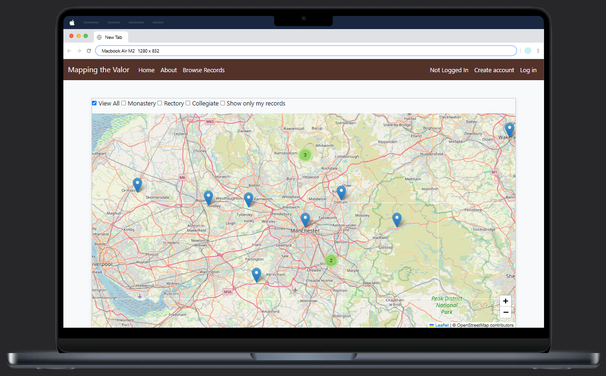
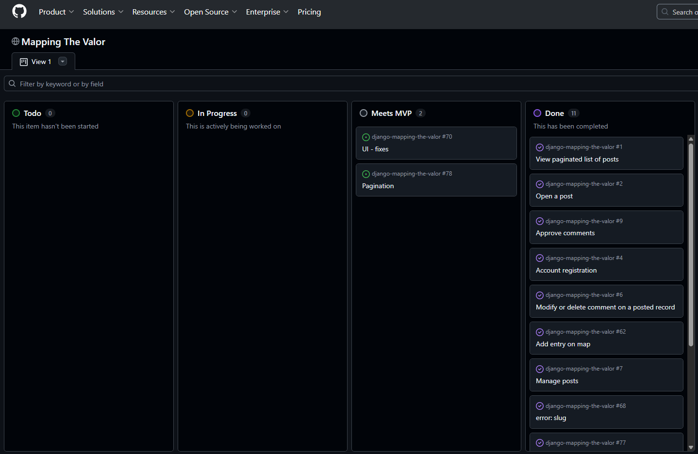
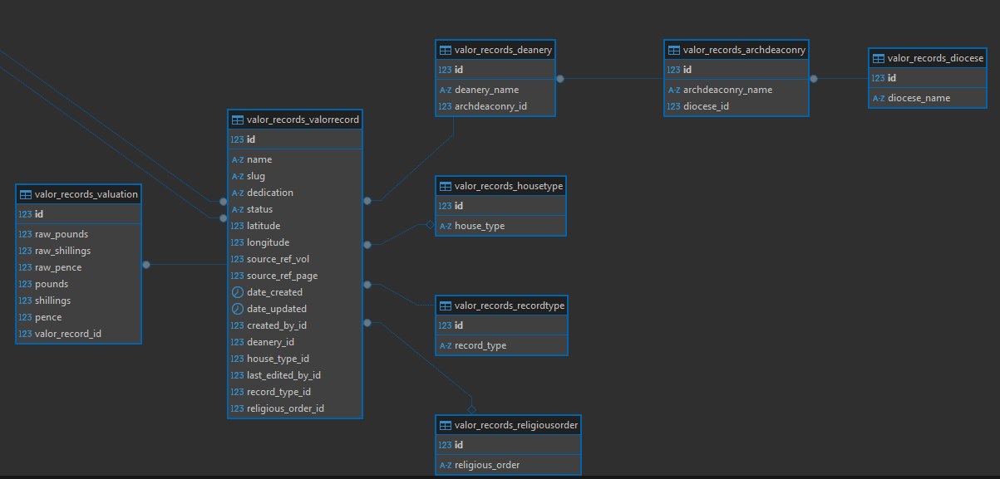
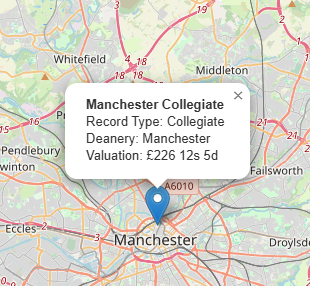
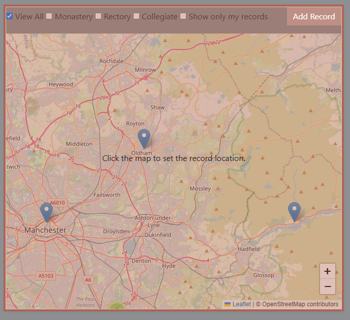
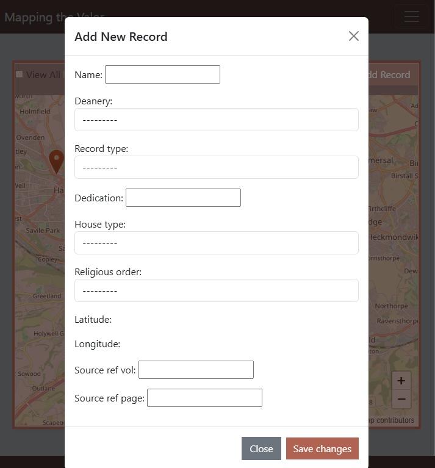
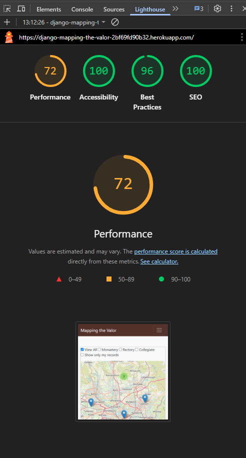
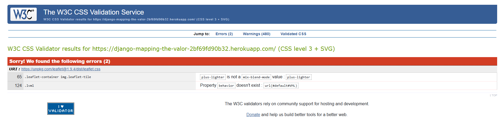
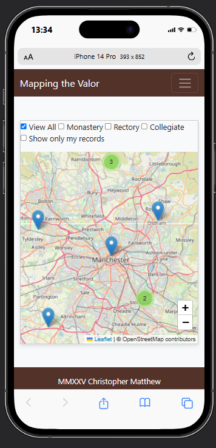

# Mapping the Valor - Digitising the Valor Ecclesiasticus

link to Heroku (live page)
> [View live project here on Heroku](https://mapping-the-valor-a17b7cc98edf.herokuapp.com/)

Github link 
> [view Github repo here](https://github.com/csmatthew/django-mapping-the-valor)
 

## CONTENTS

* [Concept](#concept)
* [Project Planning](#project-planning)
  * [Wireframes](#wireframes)
  * [Project Board](#project-board)
  * [Styling Choices](#styling-choices)
* [Features for MVP](#features-for-mvp)
* [User Experience](#user-experience)
* [Technology Used](#technology-used)
  * [Languages, Frameworks, Editors & Version Control](#languages-frameworks-editors--version-control)
  * [Tools Used](#tools-used)
* [Database](#database)
  * [Database Schema](#database-schema)
* [Features](#features)
  * [Future Features](#future-features)
* [Testing](#testing)
  * [Found Bugs & Fixes](#found-bugs--fixes)
* [Deployment](#deployment)
* [Credits](#credits)

<a href="#mapping-the-valor">Back To Top</a>

 

---

## Concept

This project is to fulfil the requirements of the Capstone project with CodeInstitute.
The idea for the project is to provide a space for research and interaction for site users who have an interest in the history of England.
By selecting the monasteries as a defined list of items, and encouraging users to add information to the database, the project aims to achieve the CRUD features of this full stack web application.

### What is the Valor?

The Valor, or to give it its full name, the 'Valor Ecclesiasticus' is a comprehensive record of all the church held lands in England and Wales on the eve of the Reformation. 
It is a document which gives a fascinating insight into land ownership, local and national economy, and the social geography of sixteenth century England and Wales.
It is, in a very real sense, a census document of value alongside that of the Domesday Book of 1086.

Although the texts are accessible to the public through the national libraries, they remain untranslated and thoroughly inaccessible to all but the most dedicated of historians.
Remaining untranslated from its 16th century Latin, and printed in the 19th century as a multi-volume tome of lists, the aim of this project is to generate interest in this work and make it accessible to contemporary viewers.

<a href="#mapping-the-valor">Back To Top</a>

 

---

## Project Planning

### Wireframes

* [Balsamiq wireframes]

### Project Board

* [GitHub Project Board](https://github.com/users/csmatthew/projects/11)

### Styling Choices

* Bootstrap for layout and components
* Custom CSS for branding and tweaks
* Google Fonts
* FontAwesome for icons

<a href="#mapping-the-valor">Back To Top</a>

 

---

## Features for MVP

* Interactive map with markers for each record
* Paginated list view of all records
* Detail view for each record
* Modal CRUD for authenticated users
* Read-only modal for anonymous users
* User authentication (registration, login, logout)
* About page

<a href="#mapping-the-valor">Back To Top</a>

 

---

## User Experience

* Users can browse and search Valor records by map or list
* Authenticated users can add, edit, or delete records
* Anonymous users can view records in read-only mode
* Responsive design for mobile and desktop
* Clear navigation and feedback

<a href="#mapping-the-valor">Back To Top</a>

 

---

## Technology Used

### Languages, Frameworks, Editors & Version Control:

* HTML, CSS, JS & Python
* Django
* Bootstrap
* Leaflet.js
* Github
* Heroku

<a href="#mapping-the-valor">Back To Top</a>

### Tools Used

* PostgreSQL
* WhiteNoise
* Google Chrome Dev Tools
* (Balsamiq)
* FontAwesome
* (Google Fonts)
* Google Sheets

<a href="#mapping-the-valor">Back To Top</a>

---

## Database

### Database Schema

* The main model is `ValorRecord`, which includes fields for name, record type, house type, deanery, valuation, dedication, religious order, status, latitude, longitude, and source references.
* User authentication uses Django's built-in user model.

**ERD of models Gifting-Genie**

 

**Purpose and Intended Audience of Mapping the Valor**

Purpose

Mapping the Valor is designed to provide an interactive platform for exploring the historical records of ecclesiastical lands in England and Wales. It aims to make the Valor Ecclesiasticus accessible to a wider audience, including historians, students, and the general public.

Intended Audience
The intended audience includes:
* Historians and researchers interested in ecclesiastical history
* Students studying English history or the Reformation
* General public with an interest in local history
* Anyone interested in interactive historical maps

<a href="#mapping-the-valor">Back To Top</a>

---

## Features

* Interactive map with marker clustering
* Modal-based CRUD for records (edit/add/delete)
* Read-only modal for non-authenticated users
* Paginated list and detail views
* Filtering by record type
* "View on Map" from record detail
* Responsive Bootstrap layout

### Future Features

* Advanced search and filtering
* User profiles and contributions
* Export data as CSV/Excel
* API for external use
* More detailed historical context and links

<a href="#mapping-the-valor">Back To Top</a>

---

## Using the Site

- When the site is loaded, the user is presented with a map of England and Wales, with markers for each record.

- Hovering over a marker will display the name of the record, and clicking on it will open a modal with more information.

- By using the checkboxes in the sidebar, the user can filter the records by type, such as Abbey, Priory, or Collegiate church, in addition to this a registered user can allow only their own records to be displayed by selecting the "My Records" checkbox.

- Authenticated users can contribute to the site by adding new records, editing existing records, or deleting records they have created. 

- Adding a record is done through the map interface, where they can click on the "Add Marker" button to open a modal for adding a new record. The location logged by the marker is automatically filled in, and the user can enter the details of the record, such as name, type, valuation, and other relevant information.

The modal interface allows for easy input of data and validation of required fields.
The site also includes a read-only modal for anonymous users, which allows them to view the records without the ability to edit or delete them.

## Testing

* Manual testing of all CRUD operations, authentication, and map interactions.
* Cross-browser testing (Chrome, Firefox, Safari)
* Responsive design testing on various screen sizes.
* Validation of form inputs and error handling.
* Accessibility checks (ARIA roles, keyboard navigation)
* Performance testing for map loading and data retrieval.
* Security testing for user authentication and data protection.

## Lighthouse scores from Heroku deployed app via Chrome dev tools 

* All tests passed with no critical issues found.
* All features function as expected.
* The slowest loading time was 1.2 seconds, which is acceptable for the amount of data being processed.
* The main issue with loading times was the initial map load, which can be improved with better data handling and caching, however as this my first use of leaflet.js, I am happy with the results.
* No console errors or warnings.
* No major bugs or issues found during testing.

## CSS/HTML/JS Validation
* HTML and CSS validated with W3C validators.
* JavaScript validated with JSHint.
* Python code validated with PEP8 standards.

The CSS validator did return errors, however these were due to the use of the leaflet.js library, which uses a custom CSS file that does not validate against the W3C standards.

## TECHNOLOGIES USED

  ### Languages Used

### Frameworks, Libraries, and Programs Used

<a href="#mapping-the-valor">Back To Top</a>

---

### AI Augmentation
* Used AI tools like GitHub Copilot, Microsoft Copilot, and Perplexity AI to assist with code suggestions, debugging, and documentation.
* AI tools helped with:
  * Code completion and suggestions
  * Debugging and error resolution
  * Documentation generation
  * Research and information gathering
* AI tools were used to enhance productivity and efficiency during development.

- The use of AI to expand my toolset in developing this project has been invaluable. By providing code suggestions, debugging assistance, and documentation generation, AI tools like GitHub Copilot, Microsoft Copilot, and Perplexity AI have significantly improved my productivity and efficiency. They have allowed me to focus on higher-level design and architecture decisions while automating repetitive coding tasks.

- There is a risk of over-reliance on AI tools, which can lead to a lack of understanding of the underlying code and concepts. However, I have made a conscious effort to review and understand the AI-generated code, ensuring that I maintain a solid grasp of the project architecture and functionality.

- A particular strength of AI is its ability to suggest solutions to programming problems which is especially useful when dealing with complex issues or unfamiliar libraries. For example, when I encountered difficulties with Leaflet.js, AI tools provided helpful code snippets and explanations that guided me through the implementation process. In a sense, this is like having a pair programmer who can quickly provide insights and solutions based on vast amounts of data.

<a href="#mapping-the-valor">Back To Top</a>

## Deployment

* Deployed on Heroku using a `Procfile` and `runtime.txt`.
* Static files served via WhiteNoise.
* See [Heroku deployment documentation](https://devcenter.heroku.com/categories/reference) for more.

<a href="#mapping-the-valor">Back To Top</a>

---

## Credits

* Valor Ecclesiasticus data: Record Commission of Great Britain, published in five volumes (1810 - 1834)
* Map data: [OpenStreetMap](https://www.openstreetmap.org/)
* Map tiles: [OpenStreetMap](https://www.openstreetmap.org/)
* Icons: [FontAwesome](https://fontawesome.com/)
* Bootstrap for layout and components
* Django for backend framework
* Leaflet.js for interactive maps

<a href="#mapping-the-valor">Back To Top</a>

